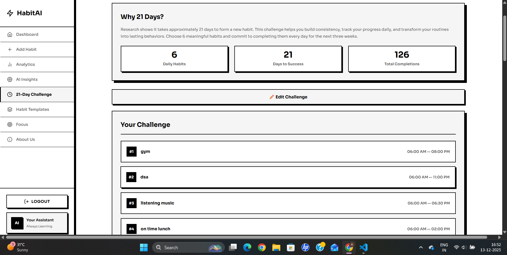
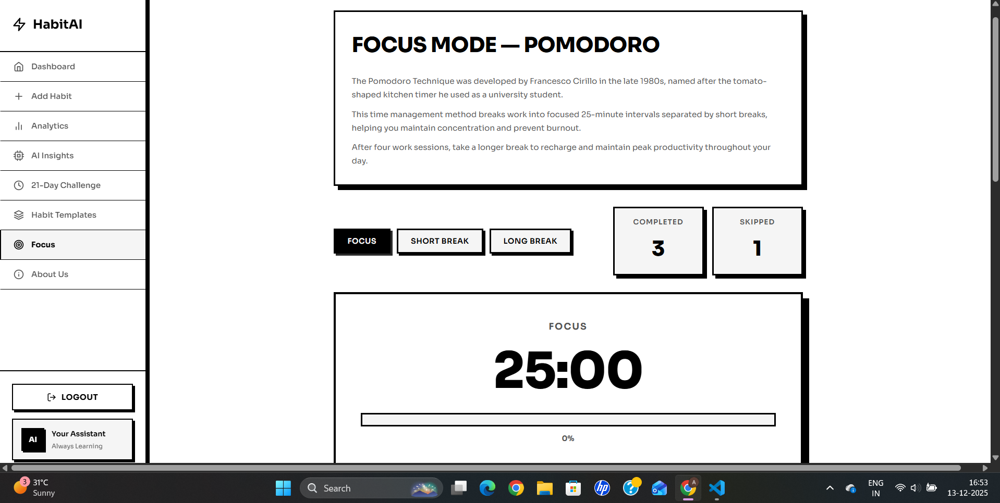
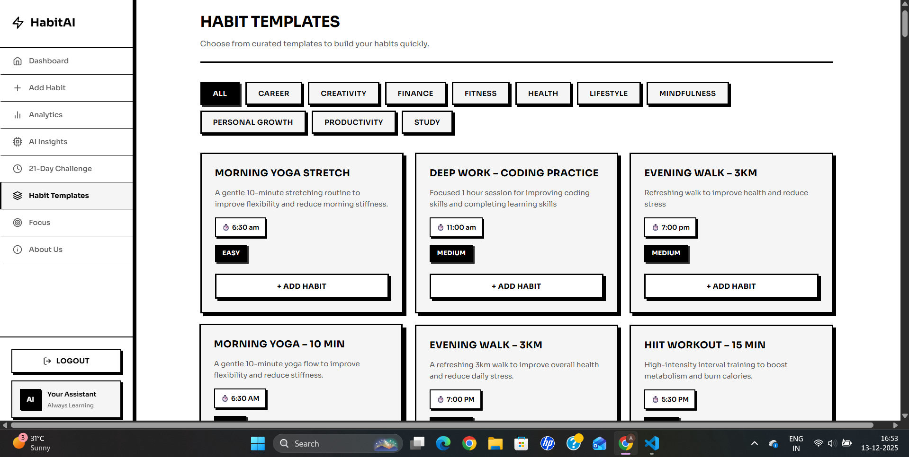

# 🧠 AI Habit Tracker

AI Habit Tracker is a full-stack, production-ready web application that helps users build consistency, improve focus, and track habits using smart insights, challenges, and visual analytics.

---

## 🌐 Live Application

**Frontend (Vercel)**  
https://ai-habit-tracker-eb72-c46m8kh3r.vercel.app

**Backend API (Render)**  
https://ai-habit-tracker-n8w9.onrender.com

---

## 📸 Output Screenshots

### Dashboard

### Daily Habits View

### Pomodoro / Focus Mode

### Habit Templates

---

## ✨ Key Features

- 🔐 User authentication with JWT
- ✅ Create, update, and track daily habits
- 📊 Visual progress analytics and charts
- 🤖 AI-based habit recommendations
- ⏱️ Focus sessions and Pomodoro tracking
- 🏆 Challenges and streak maintenance
- 📱 Responsive and clean user interface
- ☁️ Deployed with cloud-ready configuration

---

## 🛠 Technology Stack

### Frontend
- React (Vite)
- React Router DOM
- Axios
- Chart.js / Recharts
- CSS Modules

### Backend
- Node.js
- Express.js
- MongoDB with Mongoose
- JWT Authentication
- Secure CORS configuration

### Deployment
- Frontend: Vercel
- Backend: Render
- Database: MongoDB Atlas

---

## 📁 Project Structure

Ai-Habit-Tracker
└── ai-habit-tracker
    ├── client
    │   └── src
    │       └── assets
    ├── server
    └── README.md

---

## ⚙ Environment Variables

### Backend (server/.env)
PORT=10000
MONGO_URI=your_mongodb_uri
JWT_SECRET=your_jwt_secret

### Frontend (client/.env)
VITE_API_BASE_URL=https://ai-habit-tracker-n8w9.onrender.com

---

## 🚀 Local Development Setup

### 1. Clone the repository
git clone https://github.com/aayush45123/Ai-Habit-Tracker.git
cd Ai-Habit-Tracker/ai-habit-tracker

### 2. Backend setup
cd server
npm install
npm start

Backend runs at http://localhost:10000

### 3. Frontend setup
cd ../client
npm install
npm run dev

Frontend runs at http://localhost:5173

---

## 🌍 Deployment Configuration

### Vercel (Frontend)
- Root Directory: ai-habit-tracker/client
- Build Command: npm run build
- Output Directory: dist

### Render (Backend)
- Root Directory: ai-habit-tracker/server
- Build Command: npm install
- Start Command: npm start

---

## 🔐 Production Notes

- ✅ CORS configured for localhost and all Vercel deployments
- ✅ Secure environment variables
- ✅ Optimized Vite production build
- ✅ Compatible with Node.js 22

---

## 📈 Future Enhancements

- 📬 Push notifications and reminders
- 📱 Mobile-first experience
- 🧠 Advanced AI personalization
- 📄 Data export and reports
- 🌐 Custom domain support

---

## 👨‍💻 Author

**Aayush**  
AI & Data Science Student  
Full-Stack Developer

---

## 📄 License

This project is open source and available under the MIT License.

---

## 🤝 Contributing

Contributions, issues, and feature requests are welcome!  
Feel free to check the issues page.

---

## ⭐ Show your support

Give a ⭐️ if this project helped you!

EOF
