<div align="center">


# AI Habit Tracker

**A production-grade, full-stack, AI & ML-driven habit, fitness, and lifestyle optimization platform.**

[](https://react.dev/)
[](https://nodejs.org/)
[](https://expressjs.com/)
[](https://www.mongodb.com/atlas)
[](https://scikit-learn.org/)
[](https://groq.com/)
[](https://upstash.com/)
[](https://socket.io/)
[](#license)

[Live Application](https://ai-habit-tracker-eb72.vercel.app) &nbsp;·&nbsp; [Report an Issue](../../issues) &nbsp;·&nbsp; [Request a Feature](../../issues)

</div>

---

## Table of Contents

1. [Overview](#overview)
2. [Screenshots](#screenshots)
3. [Features](#features)
4. [System Architecture](#system-architecture)
5. [AI & Machine Learning](#ai--machine-learning)
6. [Technology Stack](#technology-stack)
7. [Database Schema](#database-schema)
8. [API Reference](#api-reference)
9. [Automated Jobs & Real-Time Engine](#automated-jobs--real-time-engine)
10. [Project Structure](#project-structure)
11. [Getting Started](#getting-started)
12. [Environment Variables](#environment-variables)
13. [Deployment](#deployment)
14. [Security](#security)
15. [Technical Highlights](#technical-highlights)
16. [Roadmap](#roadmap)
17. [Contributing](#contributing)
18. [License](#license)
19. [Author](#author)

---

## Overview

**AI Habit Tracker** reimagines habit tracking as a predictive, explainable, and multimodal lifestyle system rather than a simple checklist app. It unifies habit tracking, structured 21-day challenges, workout programming, nutrition tracking, Pomodoro-based focus analytics, and a multidimensional lifestyle journal into a single dashboard, powered by both a classical machine learning model and a large language model.

Core design principles:

- **Explainable AI (XAI):** every prediction and recommendation ships with `reasons[]`, `factorWeights[]`, a confidence score, and a suggested action — never an opaque output.
- **Multi-tiered AI resilience:** primary inference through low-latency Groq Llama 3.3 70B, with automatic fallback to deterministic rule-based logic to guarantee uptime during upstream outages.
- **Timezone-safe by design:** all date boundaries are normalized to IST (`UTC+5:30`), with cross-midnight window logic for habits that span 00:00.
- **Data-driven insight, not vanity metrics:** a built-in Pearson correlation engine surfaces real relationships between sleep, mood, hydration, and productivity.

---

## Screenshots

<table>
<tr>
<td align="center" width="50%">
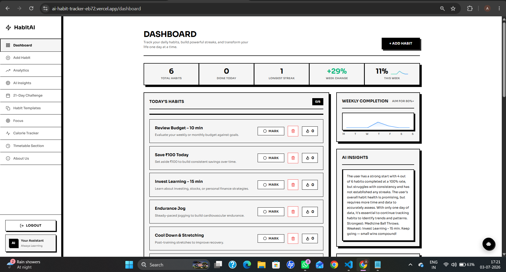
<b>Unified Dashboard</b>
</td>
<td align="center" width="50%">
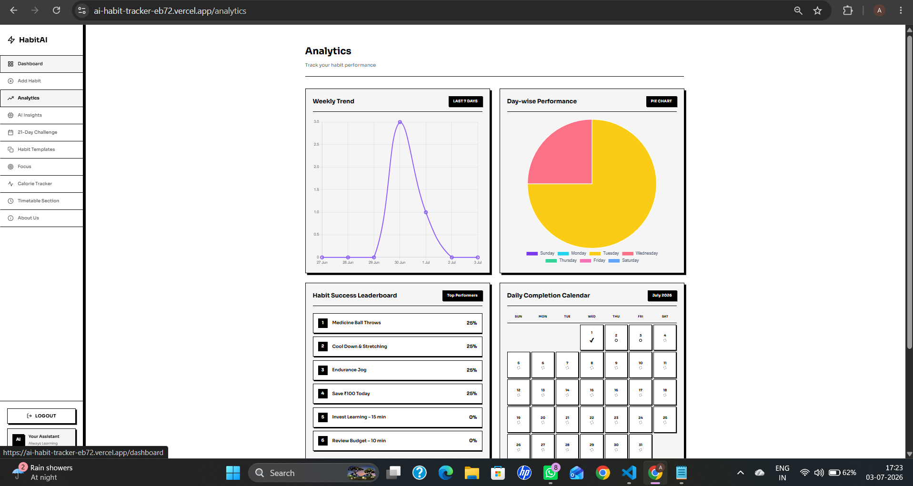
<b>Analytics & Trends</b>
</td>
</tr>
<tr>
<td align="center">
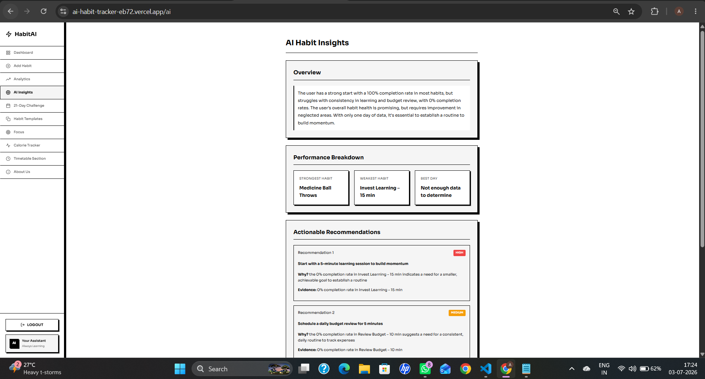
<b>Explainable AI Insights</b>
</td>
<td align="center">
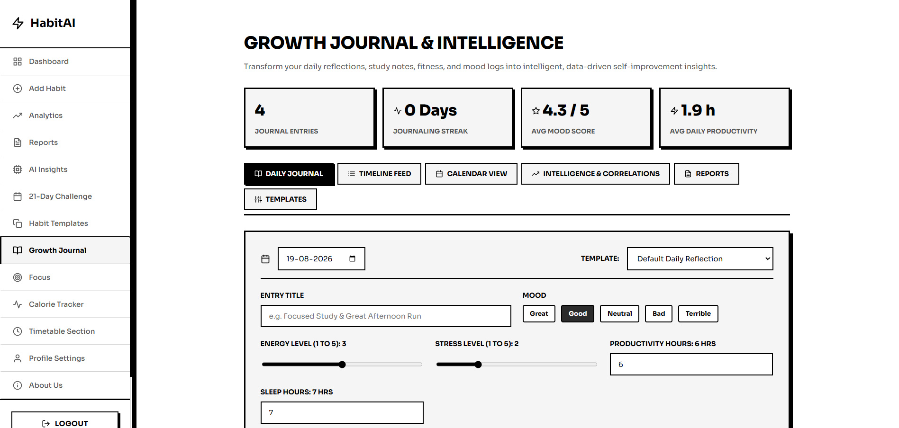
<b>Growth & Progress Trends</b>
</td>
</tr>
<tr>
<td align="center">
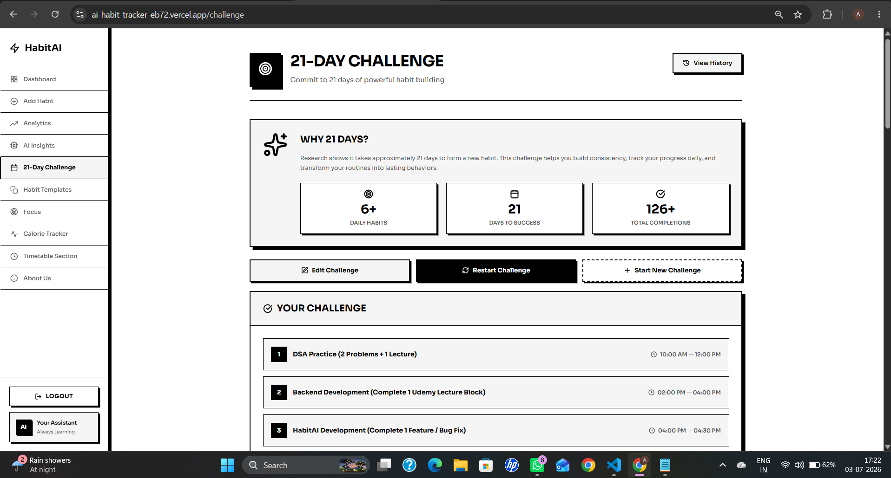
<b>21-Day Habit Challenge</b>
</td>
<td align="center">
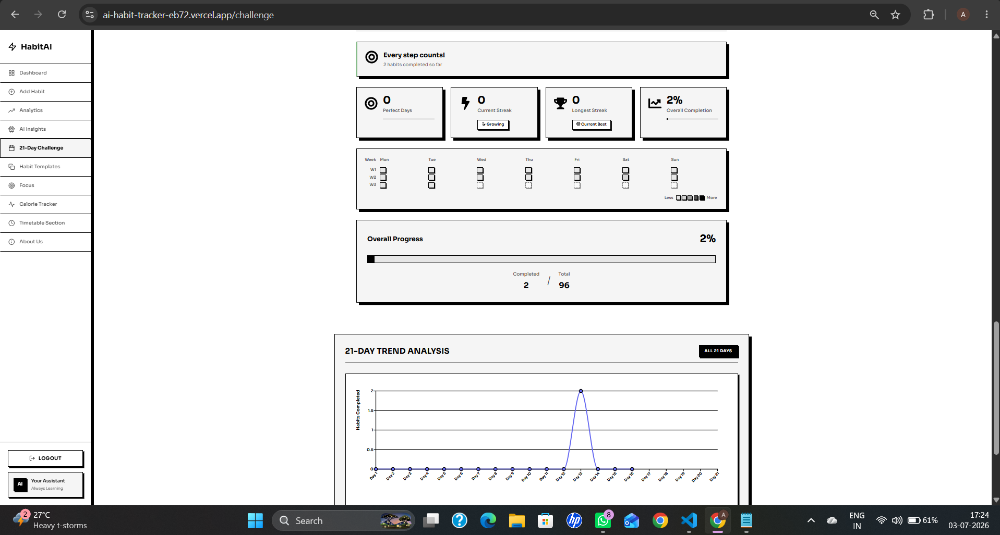
<b>Challenge Heatmap</b>
</td>
</tr>
<tr>
<td align="center">
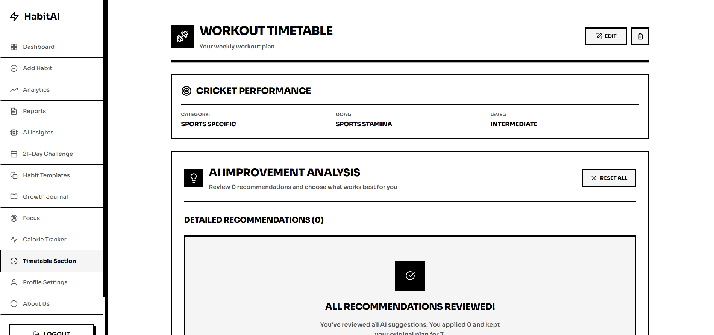
<b>Workout Timetable Builder</b>
</td>
<td align="center">
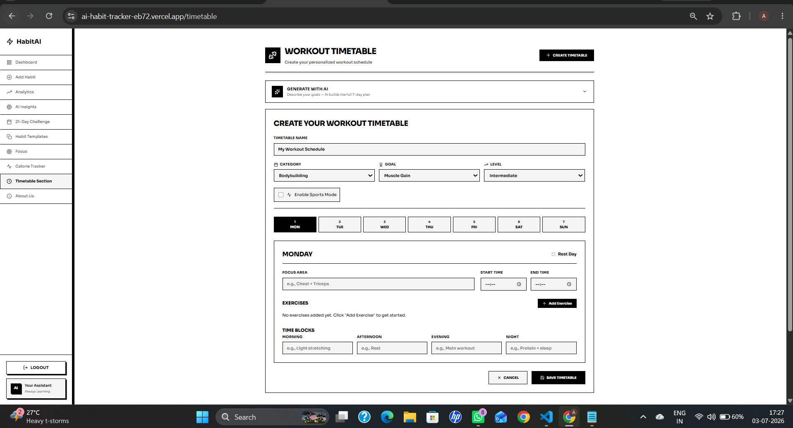
<b>Daily Workout Checkpoint</b>
</td>
</tr>
<tr>
<td align="center">
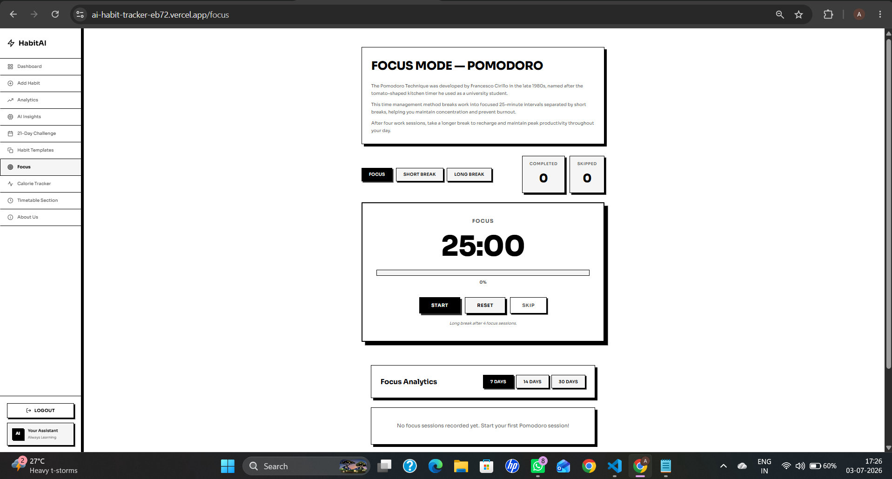
<b>Pomodoro Focus Mode</b>
</td>
<td align="center">
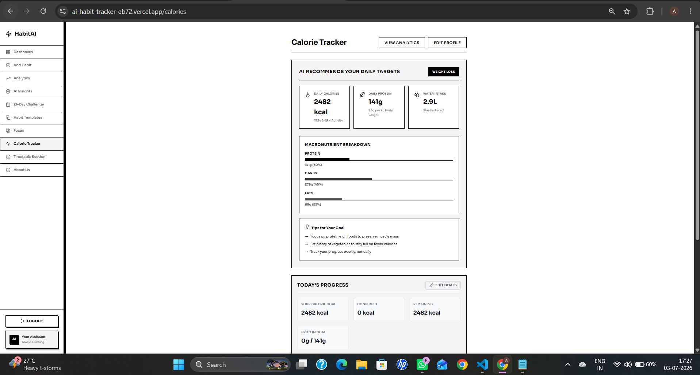
<b>Calorie & Macro Tracker</b>
</td>
</tr>
<tr>
<td align="center">
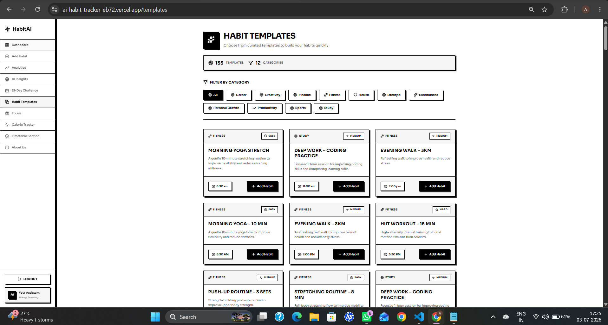
<b>Habit Templates Library</b>
</td>
<td align="center">
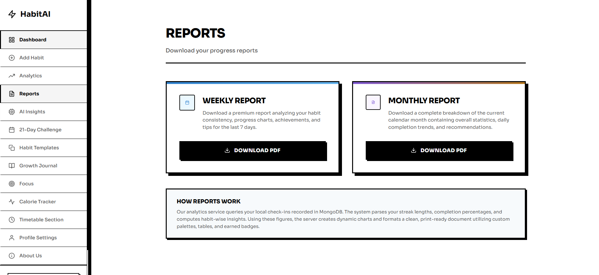
<b>Analytics Reports & PDF Export</b>
</td>
</tr>
</table>

---

## Features

### AI-Powered
- Explainable habit recommendations with reasoning, factor weights, and confidence ratings
- Groq Llama 3.3–powered daily briefs, weekly summaries, and AI chat coach
- Random Forest–based churn/risk classifier with a factor-weighted XAI panel
- AI-assisted 7-day workout timetable generation and day-by-day improvement suggestions
- AI nutritionist analysis for macro and calorie adjustments
- Deterministic rule-based fallback engines to guarantee 100% uptime if AI providers are unavailable

### Habit Tracking
- Full CRUD for habits with category, frequency, and target start dates
- Daily check-ins with automatic streak calculation, longest-streak tracking, and auto-recovery
- Automated midnight streak reset via scheduled cron job (IST-aware)

### 21-Day Challenge System
- Structured behavioral-conditioning challenge engine based on habit-loop psychology
- Custom start/end time windows per habit, including cross-midnight scheduling
- Interactive 20-day color-coded completion heatmap
- Full challenge lifecycle: restart with existing habits, start fresh, or archive and review history

### Productivity & Focus
- Pomodoro timer with focus/short-break/long-break session logging
- Focus streak tracking and time-distribution analytics

### Fitness & Nutrition
- Sport-specific workout periodization (cricket, football, basketball, running, swimming) alongside bodybuilding, powerlifting, calisthenics, and general fitness modes
- Daily exercise checklist with sets, reps, rest intervals, and post-session reflection
- Calorie, macro, and hydration logging with configurable daily goals

### Lifestyle Journal
- 7 modular journal templates (Default, Student, Developer, Fitness, Business, Personal, Custom)
- Multidimensional daily logging: mood, energy, stress, sleep, productivity, steps, gratitude
- Pearson correlation engine surfacing statistically meaningful lifestyle relationships
- Automated weekly and monthly rollup reports

### Reporting & Real-Time
- Server-rendered PDF progress reports with embedded charts
- Real-time achievement notifications and streak milestones via Socket.IO
- Automated email pipeline for daily reminders and weekly performance digests

### Security & Access Control
- JWT-based stateless authentication with bcrypt password hashing
- Email verification flow with time-boxed tokens
- Role-based route protection (`ProtectedRoute`, `ProfileRequiredRoute`, `ProtectedAdminRoute`)

---

## System Architecture

```
                         ┌───────────────────────────────────┐
                         │        Client (React 19 + Vite)     │
                         │      Deployed on Vercel Edge CDN    │
                         └───────────────────┬─────────────────┘
                                             │ HTTPS REST · WSS
                                             ▼
                         ┌───────────────────────────────────┐
                         │     Backend (Node.js 22 + Express 5)│
                         │           Hosted on Render           │
                         └──┬──────┬────────┬────────┬──────┬──┘
                            │      │        │        │      │
              ┌─────────────┘      │        │        │      └─────────────┐
              ▼                    ▼        ▼        ▼                    ▼
     ┌────────────────┐   ┌──────────────┐ ┌────┐ ┌───────┐   ┌────────────────────┐
     │ MongoDB Atlas   │   │ Python ML    │ │Groq│ │ Redis │   │ Cloudinary & Brevo │
     │ (Mongoose ODM)  │   │ (scikit-learn)│ │LLM │ │(Upstash)│  │ (Media & Email)    │
     └────────────────┘   └──────────────┘ └────┘ └───────┘   └────────────────────┘
```

- The React SPA communicates with Express exclusively through a versioned REST API and a Socket.IO WebSocket channel.
- Risk prediction is delegated to a Python subprocess running a trained Random Forest classifier.
- Natural-language insight generation is delegated to Groq Llama 3.3, with OpenAI / Google Generative AI as secondary fallbacks.
- Upstash Redis provides read-through caching for expensive dashboard aggregations.

---

## AI & Machine Learning

### Risk & Churn Classifier
| | |
|---|---|
| **Algorithm** | `RandomForestClassifier` (scikit-learn) |
| **Hyperparameters** | `n_estimators=200`, `max_depth=5`, `min_samples_split=5`, `min_samples_leaf=3`, `class_weight='balanced'` |
| **Input features** | streak, completion ratio, longest streak, total logs, missed logs, success rate, habit age |
| **Serving** | Node.js spawns a Python subprocess (`predict.py`), parsing stdout JSON for the risk label, class probabilities, and confidence |

### Generative AI Pipeline
| | |
|---|---|
| **Primary model** | Groq `llama-3.3-70b-versatile` |
| **Fallbacks** | OpenAI, Google Generative AI, deterministic rule-based engine |
| **Output contract** | Strict JSON schema with markdown-stripping and enum validation before reaching the client |
| **Use cases** | Daily briefs, habit recommendations, AI chat coach, workout timetable generation & improvement suggestions, nutrition analysis |

Every AI response includes an `explainability` object — reasoning path, confidence score, and the specific data points that drove the output — rather than a single opaque conclusion.

---

## Technology Stack

| Layer | Technologies |
|---|---|
| **Frontend** | React 19, Vite 5, React Router DOM v7, Chart.js, Recharts, Lucide React |
| **Backend** | Node.js 22, Express 5, Zod (validation) |
| **Database** | MongoDB Atlas, Mongoose 9 |
| **Caching** | Upstash Redis (REST) with ioredis TCP fallback |
| **Machine Learning** | Python 3.10+, scikit-learn, pandas, joblib |
| **Generative AI** | Groq SDK (Llama 3.3 70B), OpenAI, Google Generative AI |
| **Real-Time** | Socket.IO 4.8 |
| **Auth** | JSON Web Tokens, bcryptjs |
| **Email** | Brevo HTTP API v3 |
| **Media Storage** | Cloudinary, Multer |
| **PDF Generation** | PDFKit, chartjs-node-canvas |
| **Scheduling** | Node-Cron 4 |
| **Hosting** | Vercel (frontend), Render (backend) |

---

## Database Schema

```
User ──1:1── UserProfile          JournalEntry (mood, sleep, productivity, steps)
 │                                 
 ├──1:1── CalorieProfile           FocusLog (Pomodoro sessions)
 │
 ├──1:N── Habit ──1:N── HabitLog
 │
 ├──1:N── Timetable ──1:N── WorkoutLog
 │
 └──1:N── Challenge ──1:N── ChallengeLog
```

Key compound indexes: `{ userId, date }` on `JournalEntry` / `FocusLog`, `{ userId, timetableId, date }` on `WorkoutLog`, `{ userId, isActive }` on `Timetable`.

---

## API Reference

All endpoints are prefixed with `/api` and require a valid JWT unless noted otherwise.

<details>
<summary><b>Authentication & Profile</b></summary>

| Method | Endpoint | Description |
|---|---|---|
| POST | `/auth/register` | Register a new user |
| POST | `/auth/login` | Authenticate and issue a JWT |
| GET | `/auth/verify-email` | Verify email address |
| GET / PUT | `/profile` | Retrieve / update profile |
| POST | `/profile/upload-image` | Upload avatar to Cloudinary |

</details>

<details>
<summary><b>Habits & Challenges</b></summary>

| Method | Endpoint | Description |
|---|---|---|
| GET / POST | `/habits` | List / create habits |
| PUT / DELETE | `/habits/:id` | Update / delete a habit |
| POST | `/habits/:id/log` | Log daily completion |
| POST | `/challenge/start` | Start a new 21-day challenge |
| POST | `/challenge/restart` | Restart with the same habits |
| GET | `/challenge/heatmap` | Matrix heatmap dataset |
| GET | `/challenge/history` | Archived challenge history |

</details>

<details>
<summary><b>AI & Analytics</b></summary>

| Method | Endpoint | Description |
|---|---|---|
| GET | `/ai/risk-analysis` | Random Forest risk assessment with XAI breakdown |
| GET | `/ai/recommendations` | Personalized habit recommendations |
| GET | `/ai/daily-brief` | AI-generated daily overview |
| POST | `/ai-chat/message` | Send a message to the AI coach |
| POST | `/ai-timetable/generate` | Auto-generate a 7-day workout timetable |
| GET | `/journal/analytics` | Pearson correlation insights |
| GET | `/reports/export` | Stream a downloadable PDF report |

</details>

<details>
<summary><b>Focus, Nutrition & Admin</b></summary>

| Method | Endpoint | Description |
|---|---|---|
| POST | `/focus/log` | Record a Pomodoro session |
| GET / POST | `/calories` | List / add food log entries |
| GET | `/templates` | List public habit templates |
| GET | `/admin/stats` | System-wide usage statistics (admin only) |

</details>

---

## Automated Jobs & Real-Time Engine

- **Daily Streak Reset** — `1 0 * * *` (Asia/Kolkata): audits all habits, resets streaks with no valid prior-day log while preserving `longestStreak`.
- **Daily Reminder Email** — dispatched at a user-configured time listing pending habits.
- **Weekly Summary Email** — Sunday 9 PM IST digest with AI-generated tips.
- **Socket.IO events** — `habit_completed`, `streak_milestone`, `challenge_update` for live, cross-device updates.

---

## Project Structure

```
Ai-Habit-Tracker/
├── README.md
├── feature.md                     # Full technical architecture documentation
└── ai-habit-tracker/
    ├── client/                    # React 19 frontend (Vite)
    │   └── src/
    │       ├── assets/            # Brand graphics & screenshots
    │       ├── components/        # Dashboard widgets, charts, panels
    │       ├── context/           # Auth & app-level state
    │       ├── pages/             # Route-level views (Dashboard, Journal, Timetable, etc.)
    │       ├── services/          # API & socket clients
    │       └── utils/             # Route guards
    └── server/                    # Node.js + Express backend
        ├── python/                # Random Forest training & inference scripts
        └── src/
            ├── ai/                # Coach engine & profile generator
            ├── config/            # DB & Redis configuration
            ├── controllers/       # REST endpoint controllers
            ├── cron/              # Scheduled jobs
            ├── middleware/        # Auth, admin, upload middleware
            ├── models/            # Mongoose schemas
            ├── routes/            # Express routers
            ├── services/          # Email, Groq, Redis, correlation services
            └── validators/        # Zod schemas
```

---

## Getting Started

### Prerequisites
- Node.js 22+
- npm
- MongoDB Atlas account (or local MongoDB)
- Python 3.10+ (for the ML service)

### 1. Clone the repository
```bash
git clone https://github.com/aayush45123/Ai-Habit-Tracker.git
cd Ai-Habit-Tracker/ai-habit-tracker
```

### 2. Backend setup
```bash
cd server
npm install
npm start
```
Runs by default at `http://localhost:5000`.

### 3. Frontend setup
```bash
cd ../client
npm install
npm run dev
```
Runs by default at `http://localhost:5173`.

### 4. (Optional) Train the ML model locally
```bash
cd server/python
pip install -r requirements.txt
python train.py
```

---

## Environment Variables

**Backend (`server/.env`)**
```env
PORT=5000
MONGO_URI=mongodb+srv://<user>:<password>@cluster.mongodb.net/ai-habit-tracker
JWT_SECRET=your_jwt_secret_key_here
REDIS_URL=rediss://default:<token>@<host>.upstash.io:6379
UPSTASH_REDIS_REST_URL=https://<host>.upstash.io
UPSTASH_REDIS_REST_TOKEN=your_upstash_rest_token
GROQ_API_KEY=gsk_your_groq_api_key
OPENAI_API_KEY=sk-your_openai_key
CLOUDINARY_CLOUD_NAME=your_cloud_name
CLOUDINARY_API_KEY=your_cloudinary_key
CLOUDINARY_API_SECRET=your_cloudinary_secret
BREVO_API_KEY=xkeysib-your_brevo_api_key
EMAIL_FROM_NAME=AI Habit Tracker
EMAIL_FROM_ADDRESS=your_verified_sender@domain.com
CLIENT_URL=https://ai-habit-tracker-eb72.vercel.app
```

**Frontend (`client/.env`)**
```env
VITE_API_BASE_URL=https://ai-habit-tracker-n8w9.onrender.com
```

---

## Deployment

| | Frontend | Backend |
|---|---|---|
| **Platform** | Vercel | Render |
| **Root directory** | `ai-habit-tracker/client` | `ai-habit-tracker/server` |
| **Build command** | `npm run build` | `npm install` |
| **Start / output** | `dist` (SPA rewrites to `index.html`) | `npm start` → `node src/server.js` |
| **Deploys** | Auto-deploy on push to `main` | Auto-deploy on push to `main` |

CORS is restricted to `localhost:5173`, the production Vercel domain, and dynamic `*.vercel.app` preview deployments.

---

## Security

- Stateless JWT authentication validated in dedicated middleware
- Passwords salted and hashed with bcrypt; never returned in query results
- Time-boxed email verification tokens
- Strict CORS origin whitelist
- Zero hardcoded credentials — all secrets isolated via `.env` and `.gitignore`

---

## Technical Highlights

- Explainable AI layer surfacing `reasons[]`, `factorWeights[]`, `confidence`, and `actionSuggestion` on every prediction
- Multi-tiered AI fallback chain (Groq → OpenAI/Google GenAI → deterministic rules) for guaranteed uptime
- Cross-midnight time-window validation for habits and challenges spanning day boundaries
- Dual-mode Redis adapter (REST for serverless, TCP via ioredis as fallback)
- Route-level code splitting with manual Rollup chunking and bundle telemetry
- Server-rendered, chart-embedded PDF exports for weekly/monthly reports

---

## Roadmap

- [ ] Unified Habit Health Score combining multiple behavioral signals
- [ ] Automated weekly AI-generated PDF reports delivered by email
- [ ] Smart trend analytics with anomaly detection
- [ ] Automated model retraining pipeline with versioning & rollback
- [ ] Dedicated ML monitoring dashboard
- [ ] Push notifications
- [ ] User data export

---

## Contributing

Contributions, issues, and feature requests are welcome.

1. Fork the repository
2. Create a feature branch (`git checkout -b feature/your-feature`)
3. Commit your changes
4. Push to the branch
5. Open a pull request

Please open an issue to discuss significant changes before submitting a pull request.

---

## License

This project is licensed under the MIT License.

---

## Author

<div align="center">


**Aayush**
AI & Data Science Student · Full-Stack Developer

[GitHub](https://github.com/aayush45123) &nbsp;·&nbsp; [LinkedIn](https://www.linkedin.com/)

If this project was useful to you, consider starring the repository.
</div>
